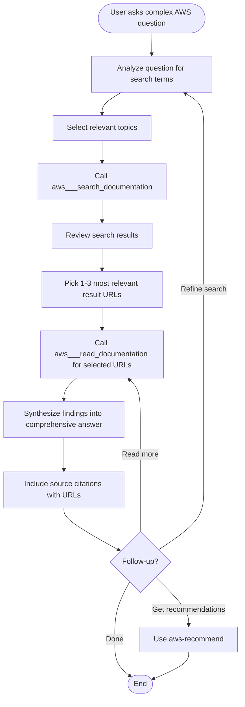

# AWS Research (Search + Read)

Comprehensive AWS research that combines searching and reading documentation for thorough, sourced answers via the AWS Knowledge MCP server at `https://knowledge-mcp.global.api.aws`.

## Overview

This is a composite skill that chains two MCP tools: `aws___search_documentation` to find relevant pages, then `aws___read_documentation` to fetch the full content. It synthesizes findings into a comprehensive answer with source citations. Best for users who want depth beyond a simple search result list.

## When to Use

- User asks a complex AWS question needing a detailed answer
- User wants comprehensive understanding of an AWS topic
- User says "research AWS", "explain AWS to me", "deep dive into AWS"
- User's question implies they want thoroughness, not just links
- User asks "help me understand" or "I need to learn about" an AWS topic

## When NOT to Use

- User wants a quick search (just links) → use `aws-search-docs`
- User has a specific URL to read → use `aws-read-docs`
- User wants to check regional availability → use `aws-check-availability`
- User wants step-by-step operational procedures → use `aws-retrieve-sop`
- Non-AWS questions

## Workflow



## Implementation

### Step 1: Analyze the Question

Break down the user's question into:
- Core search terms (service names, features, concepts)
- Relevant topic categories (see topic table in `aws-search-docs`)
- Whether to include `agent_sops` topic for actionable queries

### Step 2: Search for Relevant Documentation

```bash
curl -s -X POST https://knowledge-mcp.global.api.aws \
  -H "Content-Type: application/json" \
  -H "Accept: application/json, text/event-stream" \
  -d '{
    "jsonrpc": "2.0",
    "id": 1,
    "method": "tools/call",
    "params": {
      "name": "aws___search_documentation",
      "arguments": {
        "search_phrase": "<SEARCH_PHRASE>",
        "topics": ["<TOPIC_1>", "<TOPIC_2>"],
        "limit": 5
      }
    }
  }' | python3 -c "import sys,json; d=json.load(sys.stdin); r=json.loads(d['result']['content'][0]['text']); print(json.dumps(r, indent=2))"
```

### Step 3: Review and Select Results

From the search results, select the 1-3 most relevant pages based on:
- `rank_order` (lower = more relevant)
- Title match with the user's question
- Context relevance

### Step 4: Read Selected Documentation

Batch the selected URLs in a single read call:

```bash
curl -s -X POST https://knowledge-mcp.global.api.aws \
  -H "Content-Type: application/json" \
  -H "Accept: application/json, text/event-stream" \
  -d '{
    "jsonrpc": "2.0",
    "id": 1,
    "method": "tools/call",
    "params": {
      "name": "aws___read_documentation",
      "arguments": {
        "requests": [
          {
            "url": "<URL_1>",
            "max_length": 10000
          },
          {
            "url": "<URL_2>",
            "max_length": 10000
          }
        ]
      }
    }
  }' | python3 -c "import sys,json; d=json.load(sys.stdin); r=json.loads(d['result']['content'][0]['text']); print(json.dumps(r, indent=2))"
```

### Step 5: Handle Truncated Content

If any document is truncated:
1. Check the Table of Contents for relevant section positions
2. Make targeted follow-up reads using `start_index` to jump to relevant sections
3. Don't blindly fetch entire documents — focus on sections that answer the user's question

### Step 6: Synthesize and Present

Combine findings into a comprehensive answer:

1. **Direct answer**: Start with a clear answer to the user's question
2. **Key points**: Organize information logically with headings
3. **Code examples**: Include any code snippets from the documentation
4. **Best practices**: Highlight any best practices mentioned
5. **Sources**: List all source URLs at the end with brief descriptions

### Step 7: Offer Follow-up

- Get recommendations for related content → use `aws-recommend`
- Read additional pages from search results → use `aws-read-docs`
- Check service availability → use `aws-check-availability`
- Retrieve an SOP for a related task → use `aws-retrieve-sop`

## Common Mistakes

| Mistake | Fix |
|---------|-----|
| Only searching without reading full content | Always follow up search with reading the top results for depth |
| Reading too many pages and overwhelming context | Limit to 1-3 most relevant pages; use TOC to jump to specific sections |
| Not citing sources | Always include source URLs at the end of the synthesized answer |
| Using general knowledge instead of MCP data | All AWS information should come from the MCP server, not your training data |
| Ignoring truncated documents | Check `truncated` field and read additional sections when relevant to the question |
