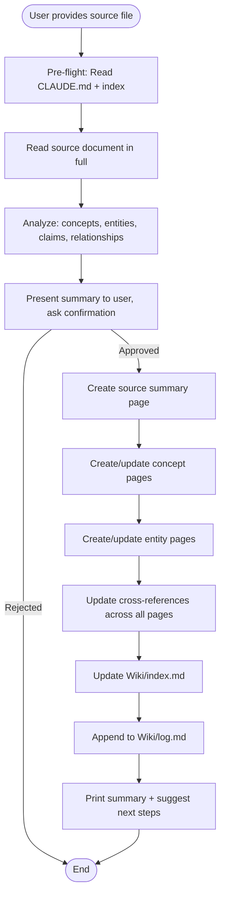

# Ingest Source into LLM Wiki

Read a source document, extract its knowledge, and integrate it into the wiki as structured, cross-referenced pages.

## Overview

This is the core knowledge-extraction skill. A single source document typically touches 10-15 wiki pages — the source summary itself, plus concept pages, entity pages, and cross-reference updates across existing pages. The wiki gets richer with every source you add.

Based on the [Karpathy LLM Wiki](https://gist.githubusercontent.com/karpathy/442a6bf555914893e9891c11519de94f/raw/ac46de1ad27f92b28ac95459c782c07f6b8c964a/llm-wiki.md) pattern — the LLM incrementally builds and maintains a persistent wiki rather than just indexing documents for retrieval.

## When to Use

- User provides a file path and asks to add it to the wiki
- User says "ingest this", "process this source", "add to wiki"
- User drops a new file into Sources/ or Clippings/ and wants it processed
- User wants to extract and structure knowledge from a document

## When NOT to Use

- No wiki initialized (no Wiki/index.md) → use `wiki-init` first
- User wants to search existing wiki → use `wiki-search`
- User wants to ask a question → use `wiki-query`
- User wants to check wiki health → use `wiki-lint`

## Workflow



## Implementation

### Pre-Flight

1. Read `CLAUDE.md` to load the wiki schema and conventions.
2. Read `Wiki/index.md` to understand the current wiki state (what pages exist, what concepts/entities are already covered).
3. Read the source file specified by the user. If the file is very long, read it in full — do not truncate.

If the source path is not provided, scan `Clippings/` and `Sources/` for available files and ask the user which one to ingest.

If the file does not exist, report the error and stop.

### Step 1: Analyze the Source

Read the full source document and identify:

- **Core topic**: What is this source primarily about?
- **Key concepts**: What concepts, technologies, or ideas are discussed in depth? List each.
- **Entities**: What people, organizations, tools, products, or companies are mentioned? Focus on those central to the source.
- **Key claims**: What are the most important assertions or findings?
- **Relationships**: How do the concepts and entities relate to each other and to existing wiki content?
- **Open questions**: What questions does this source raise but not answer?

Present a brief summary to the user (3-5 sentences) and list the concepts and entities you plan to create pages for. Ask: "Shall I proceed with creating/updating wiki pages?"

### Step 2: Create Source Summary Page

Create a new page in `Wiki/sources/`:

- Filename: lowercase, hyphenated, derived from the source title. Example: `hyde-optimizing-retrieval.md`
- Populate the full frontmatter (title, type: source, tags, created, updated, related, source_file, status: draft).
- Follow the source page body template from CLAUDE.md exactly.
- Include wikilinks to all concepts and entities mentioned.

### Step 3: Create or Update Concept Pages

For each significant concept identified (those discussed in depth, not just mentioned in passing):

a) **Check if a page exists**: Look in `Wiki/concepts/` and check the index.
b) **If it exists**: Read it. Add new information from this source. Update the `updated` date. Add this source to the `## Sources` section. Add any new related concepts as wikilinks.
c) **If it does not exist**: Create a new concept page following the concept template from CLAUDE.md. Set status to `draft`. Add a wikilink to the source page in `## Sources`.

Rule of thumb: Create concept pages for any concept that is discussed in depth or that connects to 2+ other concepts/entities already in the wiki.

### Step 4: Create or Update Entity Pages

Same process as Step 3, but for entities (organizations, tools, products, people):

a) **Check existence** in `Wiki/entities/`.
b) **Update existing** pages with new facts or context from this source.
c) **Create new** entity pages for entities that play a meaningful role in the source (not just a passing mention).

### Step 5: Update Cross-References

After all pages are created/updated:

- Review all modified pages. Ensure every wikilink points to an existing page.
- For concepts mentioned 3+ times across different pages that don't have their own page, create stub pages (status: draft, minimal content).
- Add new `related:` entries in frontmatter as needed.

### Step 6: Update Index

Update `Wiki/index.md`:

- Recount page totals in Statistics.
- Add every new page to the appropriate table with a one-line summary.
- Update the `updated` date in frontmatter.

### Step 7: Append to Log

Append an entry to `Wiki/log.md`:

```
## [YYYY-MM-DD] ingest | [Source Title]
- Created: [[source-page]], [[concept-1]], [[entity-1]]
- Updated: [[concept-2]], [[entity-2]]
- Created stubs: [[concept-3]]
- Files touched: N
```

### Step 8: Report

Print a summary:

- List all pages created and updated.
- Show total files touched.
- Suggest next steps (ingest another source, run wiki-lint, or wiki-query).

## Parameter Reference

| Parameter | Type | Required | Description |
|-----------|------|----------|-------------|
| source_path | string | Yes | File path relative to vault root (e.g., `Clippings/my-article.md`). Asked interactively if not provided. |

## Common Mistakes

| Mistake | Fix |
|---------|-----|
| Modifying the source file | Sources in `Sources/` and `Clippings/` are immutable — never edit them |
| Creating pages for concepts only mentioned once | Only create pages for concepts discussed in depth or connected to 2+ existing pages |
| Not confirming before large-scale changes | Always ask the user before creating 10+ pages in one pass |
| Skipping the index/log updates | Every ingest MUST update index.md and append to log.md |
| Truncating long source files | Read the full source document — do not skip any sections |
| Not following the page body templates from CLAUDE.md | Always follow the exact templates defined in the schema |
