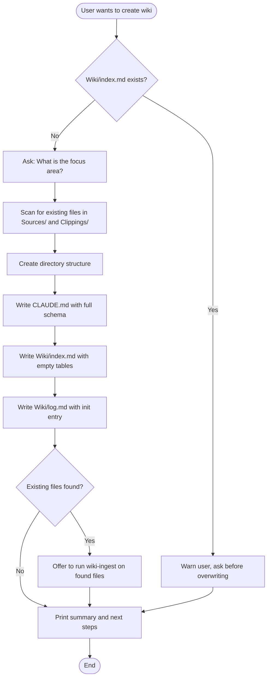

# Initialize LLM Wiki

Set up a complete LLM Wiki in the current working directory. Creates the directory structure, writes the CLAUDE.md schema, and initializes index and log files.

Based on the [Karpathy LLM Wiki](https://gist.githubusercontent.com/karpathy/442a6bf555914893e9891c11519de94f/raw/ac46de1ad27f92b28ac95459c782c07f6b8c964a/llm-wiki.md) pattern — a persistent, compounding knowledge base where the LLM writes and maintains all content.

## Overview

This skill creates the three-layer architecture:

1. **Raw sources** (`Sources/`, `Clippings/`) — immutable source documents
2. **The wiki** (`Wiki/`) — LLM-generated structured markdown pages with cross-references
3. **The schema** (`CLAUDE.md`) — configuration telling the LLM how the wiki is structured

After initialization, use `wiki-ingest` to process source documents, `wiki-query` to ask questions, `wiki-search` for quick lookups, and `wiki-lint` for health checks.

## When to Use

- User wants to set up a new knowledge wiki in a directory
- User says "initialize wiki", "create wiki", "new wiki", "set up knowledge base"
- Starting fresh with the LLM Wiki pattern in a new Obsidian vault or project
- User has source documents and wants to build a structured knowledge base

## When NOT to Use

- Wiki already initialized (Wiki/index.md exists) → use `wiki-ingest` to add content
- User wants to search existing wiki → use `wiki-search`
- User wants to ask a question → use `wiki-query`
- User wants to check wiki health → use `wiki-lint`

## Workflow



## Implementation

### Step 1: Confirm Intent and Gather Focus Area

Ask the user:

1. **"What is the primary focus area or topic for this wiki?"** (e.g., "AI/ML engineering", "AWS architecture", "Product management", "Personal knowledge")
2. **"Are there existing files you'd like to treat as sources?"** — If yes, list files found in `Clippings/` and `Sources/`.

### Step 2: Create Directory Structure

Create the following directories if they do not already exist:

```
Sources/articles/
Sources/papers/
Sources/videos/
Sources/misc/
Wiki/sources/
Wiki/concepts/
Wiki/entities/
Wiki/analyses/
Wiki/questions/
```

### Step 3: Write CLAUDE.md

Write the CLAUDE.md file at the vault root with the full wiki schema below. Insert the user's focus area in the `## Focus Area` section.

**If a CLAUDE.md already exists, warn the user and ask before overwriting.**

Use this exact template (replace `{{FOCUS_AREA}}` with the user's answer):

<!-- CLAUDE_MD_TEMPLATE_START -->

```
# LLM Wiki Schema

You are maintaining a personal knowledge wiki stored in the `Wiki/` directory of this Obsidian vault.

## Focus Area

{{FOCUS_AREA}}

## Vault Location

- Vault root: current working directory
- Raw sources: `Sources/` and `Clippings/`
- Wiki pages: `Wiki/`
- Wiki index: `Wiki/index.md`
- Wiki log: `Wiki/log.md`

## Page Types and Locations

| Type     | Folder            | Purpose                                 |
|----------|-------------------|-----------------------------------------|
| source   | Wiki/sources/     | Summary of a single source document     |
| concept  | Wiki/concepts/    | A topic, idea, or technical concept     |
| entity   | Wiki/entities/    | A person, organization, tool, or product|
| analysis | Wiki/analyses/    | Comparative or multi-source analysis    |
| question | Wiki/questions/   | Filed Q&A synthesized from wiki content |

## Frontmatter Schema

Every wiki page MUST begin with this YAML frontmatter block:

```yaml
---
title: "Human-Readable Title"
type: source | concept | entity | analysis | question
tags:
  - tag1
  - tag2
created: "YYYY-MM-DD"
updated: "YYYY-MM-DD"
related:
  - "[[page-name-1]]"
  - "[[page-name-2]]"
source_file: relative/path/to/source
status: draft | stable | needs-review
---
```

**Field rules:**

| Field        | Required             | Notes                                                       |
|--------------|----------------------|-------------------------------------------------------------|
| `title`      | Always               | Quoted string. Can contain spaces and punctuation.          |
| `type`       | Always               | Exactly one of the five types listed above.                 |
| `tags`       | Always               | Lowercase, hyphenated. Include the type as a tag.           |
| `created`    | Always               | ISO date string. Set once at creation. Never changed.       |
| `updated`    | Always               | ISO date string. Updated on every edit.                     |
| `related`    | Always               | Array of wikilinks. Minimum 1 entry.                        |
| `source_file`| Only for type: source| Relative path from vault root.                              |
| `status`     | Always               | `draft` for new, `stable` after review, `needs-review` flagged by lint. |

## Page Body Templates

### Source pages (`Wiki/sources/`)

```markdown
## Summary
[2-4 paragraph summary of the source]

## Key Points
- Point 1
- Point 2

## Notable Details
[Important specifics, data, quotes]

## Connections
- This relates to [[concept-page]] because...
- Compare with [[other-source]] which...

## Open Questions
- [ ] Question raised by this source
```

### Concept pages (`Wiki/concepts/`)

```markdown
## Definition
[Clear, concise definition]

## Explanation
[Extended explanation in plain language]

## Why It Matters
[Relevance and significance]

## How It Works
[Technical or practical details]

## Related Concepts
- [[related-concept-1]] -- brief note on relationship
- [[related-concept-2]] -- brief note on relationship

## Sources
- [[source-page-1]]
- [[source-page-2]]
```

### Entity pages (`Wiki/entities/`)

```markdown
## Overview
[1-2 paragraph description]

## Key Facts
- Fact 1
- Fact 2

## Relevance to This Wiki
[Why this entity matters in context]

## Related
- [[related-entity-or-concept]]
```

### Analysis pages (`Wiki/analyses/`)

```markdown
## Question
[What this analysis explores]

## Findings
[The analysis content]

## Sources Compared
- [[source-1]]
- [[source-2]]

## Conclusions
[Summary of findings]
```

### Question pages (`Wiki/questions/`)

```markdown
## Question
[The original question]

## Answer
[Synthesized answer with inline wikilink citations]

## Sources Consulted
- [[source-page-1]]
- [[concept-page-1]]
```

## Naming Conventions

- File names: lowercase, hyphenated, descriptive. Example: `hypothetical-document-embeddings.md`
- No spaces in filenames. No special characters except hyphens.
- File names must be unique across the entire `Wiki/` directory.
- Obsidian wikilinks use the filename without extension: `[[hypothetical-document-embeddings]]`
- The `title` frontmatter field can differ from the filename (it can have spaces, caps, etc.)

## Cross-Referencing Rules

- Use Obsidian wikilinks: `[[page-name]]` for references.
- When mentioning a concept that has (or should have) its own page, always create a wikilink.
- If a concept is mentioned in 3+ source pages, it SHOULD have its own concept page.
- Every wikilink should point to an existing page. If you reference a page that does not exist, create a stub.
- Prefer creating stub pages over leaving dangling wikilinks.

## Index Format (`Wiki/index.md`)

```markdown
---
title: "Wiki Index"
type: index
updated: "YYYY-MM-DD"
---

# Wiki Index

## Statistics
- Total pages: N
- Sources: N | Concepts: N | Entities: N | Analyses: N | Questions: N
- Last updated: YYYY-MM-DD

## Source Summaries
| Page | Source | One-line summary |
|------|--------|------------------|
| [[source-name]] | path/to/source | Summary |

## Concepts
| Page | One-line summary |
|------|------------------|
| [[concept-name]] | Summary |

## Entities
| Page | One-line summary |
|------|------------------|
| [[entity-name]] | Summary |

## Analyses
| Page | One-line summary |
|------|------------------|
| [[analysis-name]] | Summary |

## Questions
| Page | One-line summary |
|------|------------------|
| [[question-name]] | Summary |
```

## Log Format (`Wiki/log.md`)

```markdown
---
title: "Wiki Log"
type: log
---

# Wiki Log

## [YYYY-MM-DD] ingest | Source Title
- Created: [[source-page]], [[concept-1]]
- Updated: [[concept-2]], [[entity-1]]
- Created stubs: [[concept-3]]
- Files touched: N

## [YYYY-MM-DD] query | "What is HyDE?"
- Filed answer: [[question-page]]
- Sources consulted: [[source-1]], [[concept-1]]

## [YYYY-MM-DD] lint
- Broken cross-references found: N (fixed: N)
- Orphan pages found: N
- Pages flagged needs-review: N
```

Log entries use consistent prefixes so they are parseable: `grep "^## \[" Wiki/log.md | tail -5` shows the last 5 entries.

## General Rules

1. NEVER modify files in `Sources/` or `Clippings/`. They are immutable.
2. ALWAYS read CLAUDE.md before any wiki operation.
3. ALWAYS read `Wiki/index.md` first to understand current wiki state.
4. ALWAYS update `Wiki/index.md` when creating or modifying pages.
5. ALWAYS append to `Wiki/log.md` when completing a wiki operation.
6. ALWAYS update the `updated` date in frontmatter when editing a page.
7. Prefer creating stub pages over leaving dangling wikilinks.
8. When in doubt, ask the user for clarification.
9. Keep pages focused. One concept per page. One source per source page.
10. Write in a neutral, informative tone. This is a reference, not a blog.
```

<!-- CLAUDE_MD_TEMPLATE_END -->

### Step 4: Create Wiki/index.md

Write the initial index file with empty tables and zero stats:

```markdown
---
title: "Wiki Index"
type: index
updated: "TODAY"
---

# Wiki Index

## Statistics
- Total pages: 0
- Sources: 0 | Concepts: 0 | Entities: 0 | Analyses: 0 | Questions: 0
- Last updated: TODAY

## Source Summaries
| Page | Source | One-line summary |
|------|--------|------------------|

## Concepts
| Page | One-line summary |
|------|------------------|

## Entities
| Page | One-line summary |
|------|------------------|

## Analyses
| Page | One-line summary |
|------|------------------|

## Questions
| Page | One-line summary |
|------|------------------|
```

Replace `TODAY` with the current date (YYYY-MM-DD).

### Step 5: Create Wiki/log.md

Write the initial log file with an init entry:

```markdown
---
title: "Wiki Log"
type: log
---

# Wiki Log

## [TODAY] init
- Focus area: {{FOCUS_AREA}}
- Directories created: Sources/{articles,papers,videos,misc}, Wiki/{sources,concepts,entities,analyses,questions}
- Initial files: Wiki/index.md, Wiki/log.md, CLAUDE.md updated with focus area
```

Replace `TODAY` with the current date and `{{FOCUS_AREA}}` with the user's focus area.

### Step 6: Offer First Ingest

If the user has existing files in `Clippings/` or `Sources/`, offer to run `wiki-ingest` on them. Present a numbered list of found files.

### Step 7: Report

Print a summary:

```
LLM Wiki initialized!

Created:
- CLAUDE.md (wiki schema)
- Wiki/index.md (catalog)
- Wiki/log.md (activity log)
- 9 content directories under Wiki/ and Sources/

Focus area: {{FOCUS_AREA}}

Next steps:
1. Add source documents to Sources/ or Clippings/
2. Run wiki-ingest to process sources into wiki pages
3. Run wiki-query to ask questions against your knowledge base
4. Run wiki-lint periodically to keep the wiki healthy
```

## Parameter Reference

| Parameter | Type | Required | Description |
|-----------|------|----------|-------------|
| focus_area | string | Yes | The primary topic or domain for the wiki. Asked interactively if not provided. |
| existing_sources | string[] | No | Paths to existing files to ingest after initialization. |

## Common Mistakes

| Mistake | Fix |
|---------|-----|
| Overwriting an existing CLAUDE.md without asking | Always warn the user and ask for confirmation before overwriting |
| Deleting or moving existing files during init | Init only creates new files and directories — never delete or move anything |
| Not checking if Wiki/ already exists | Check for Wiki/index.md first — if it exists, the wiki is already initialized |
| Hardcoding a focus area instead of asking the user | Always ask the user about their focus area — this drives the schema configuration |
