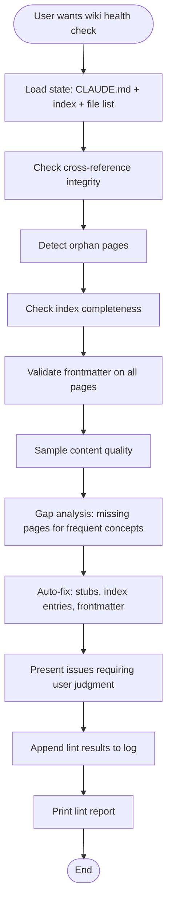

# Lint the LLM Wiki

Perform a comprehensive health check on the wiki — validate cross-references, detect orphans, check index completeness, verify frontmatter, and identify knowledge gaps.

## Overview

Wikis degrade without maintenance. Cross-references break, pages become orphaned, frontmatter drifts out of sync, and content gaps emerge. This skill systematically checks all of these and auto-fixes what it can (with confirmation), flagging the rest for user attention.

Based on the [Karpathy LLM Wiki](https://gist.githubusercontent.com/karpathy/442a6bf555914893e9891c11519de94f/raw/ac46de1ad27f92b28ac95459c782c07f6b8c964a/llm-wiki.md) pattern — periodic linting keeps the wiki healthy as it grows.

## When to Use

- User says "lint wiki", "check wiki health", "validate wiki", "audit wiki"
- After bulk-ingesting multiple sources
- Periodically to keep the wiki healthy (e.g., weekly)
- Wiki feels "messy" — broken links, outdated pages
- Before sharing or exporting the wiki

## When NOT to Use

- No wiki initialized (no Wiki/index.md) → use `wiki-init`
- User wants a quick search → use `wiki-search`
- User wants to add content → use `wiki-ingest`
- User wants to ask a question → use `wiki-query`

## Workflow



## Implementation

### Step 1: Load State

1. Read `CLAUDE.md` for the schema and conventions.
2. Read `Wiki/index.md` for the current catalog.
3. List all files in `Wiki/` recursively to get a complete inventory.

### Step 2: Cross-Reference Integrity

Check every wikilink in every wiki page:

- For each `[[link]]` found in any wiki page, verify the target file exists somewhere in `Wiki/`.
- Report broken links: `[page-a.md] references [[missing-page]] which does not exist`.
- For each broken link, offer to create a stub page.

### Step 3: Orphan Detection

Find pages that are never linked to from any other wiki page:

- Build a set of all existing wiki pages (filenames without extension).
- Build a set of all wikilinks found across all pages.
- Pages in set 1 but not in set 2 are orphans.
- Exception: `index.md` and `log.md` are expected to have no inbound links.
- Report orphans and suggest where cross-references could be added.

### Step 4: Index Completeness

Compare the index against actual files:

- Every file in `Wiki/sources/`, `Wiki/concepts/`, `Wiki/entities/`, `Wiki/analyses/`, `Wiki/questions/` should appear in the index.
- Every entry in the index should correspond to an actual file.
- Report discrepancies.

### Step 5: Frontmatter Validation

For every wiki page, verify:

- Frontmatter exists and is valid YAML.
- All required fields are present: title, type, tags, created, updated, related, status.
- `type` matches the page's folder location (e.g., pages in `Wiki/concepts/` should have `type: concept`).
- `updated` date is not older than `created` date.
- `related` entries use wikilink syntax `[[]]`.

### Step 6: Content Quality

Sample 5-10 pages (or all, if there are fewer than 10) and check:

- Pages are not empty or near-empty (stubs are OK if marked `status: draft`).
- Source pages reference their `source_file` in frontmatter.
- Concept pages have a `## Sources` section with at least one entry.
- No obvious contradictions between pages (e.g., two concept pages giving conflicting definitions).
- Pages with `status: needs-review` are flagged for user attention.

### Step 7: Gap Analysis

Based on the current wiki content:

- Identify concepts that are frequently mentioned across pages but lack their own concept page.
- Identify entities that appear in 3+ pages but have no entity page.
- Suggest new source documents or topics to ingest based on identified gaps.

### Step 8: Fix What Can Be Fixed

For issues that can be auto-fixed (ask for confirmation first):

- Create stub pages for missing wikilink targets (set status to `draft`).
- Add missing pages to the index.
- Fix frontmatter errors (missing fields, wrong type).
- Add cross-references to orphan pages from related pages.

For issues requiring user judgment, present them clearly and wait for direction:

- Contradictions between pages.
- Whether to promote stubs to full pages.
- Which suggested sources to prioritize.

### Step 9: Update Log

Append to `Wiki/log.md`:

```
## [YYYY-MM-DD] lint
- Broken cross-references found: N (fixed: N)
- Orphan pages found: N
- Missing from index: N (fixed: N)
- Frontmatter issues: N (fixed: N)
- Stub pages created: N
- Pages flagged needs-review: N
- Gaps identified: N
```

### Step 10: Report

Print a summary:

```
Wiki Lint Report

Issues Found:
- Broken links: N (N auto-fixed)
- Orphan pages: N
- Missing index entries: N (N auto-fixed)
- Frontmatter issues: N (N auto-fixed)
- Contradictions: N
- Content gaps: N

Actions Taken:
- Created N stub pages
- Updated N frontmatter blocks
- Added N entries to index

Recommended Next Steps:
- [Specific suggestions based on findings]
```

## Parameter Reference

| Parameter | Type | Required | Description |
|-----------|------|----------|-------------|
| auto_fix | boolean | No | Whether to auto-fix issues without asking. Default: false (always ask first). |
| sample_size | integer | No | Number of pages to sample for content quality. Default: 10, or all if fewer exist. |

## Common Mistakes

| Mistake | Fix |
|---------|-----|
| Modifying page body content without asking | Only auto-fix frontmatter and index — body content changes require user confirmation |
| Not sampling on large wikis (>50 pages) | For wikis with 50+ pages, sample rather than checking every page for content quality (Steps 5-6). Always check cross-references and orphans on all pages. |
| Flagging minor style inconsistencies | Be thorough but practical. Minor style differences are not worth flagging. |
| Running lint without reading CLAUDE.md first | Always read CLAUDE.md first — the schema defines what "correct" looks like |
| Not offering gap analysis | Gap analysis is the most valuable part — it tells the user what to ingest next |
