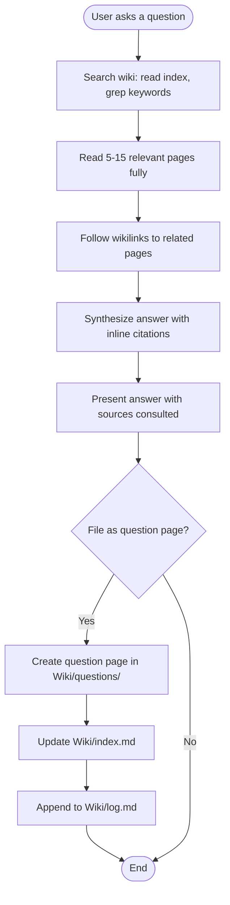

# Query the LLM Wiki

Search wiki pages, synthesize a comprehensive answer with inline citations, and optionally file it as a new page.

## Overview

This is where the wiki pays off. Instead of re-reading source documents, the LLM searches pre-compiled wiki pages, follows cross-references, and synthesizes a cited answer. Good answers can be filed back into the wiki, so your explorations compound over time.

Based on the [Karpathy LLM Wiki](https://gist.githubusercontent.com/karpathy/442a6bf555914893e9891c11519de94f/raw/ac46de1ad27f92b28ac95459c782c07f6b8c964a/llm-wiki.md) pattern — good answers get filed as new pages, so the wiki keeps getting richer.

## When to Use

- User asks a question that can be answered from wiki content
- User says "what does my wiki say about...", "query the wiki", "ask the wiki"
- User wants to synthesize information across multiple wiki pages
- User wants a comparison or analysis based on wiki knowledge

## When NOT to Use

- User wants a quick search without synthesis → use `wiki-search`
- User wants to add a source document → use `wiki-ingest`
- No wiki initialized (no Wiki/index.md) → use `wiki-init`
- User wants to check wiki health → use `wiki-lint`

## Workflow



## Implementation

### Step 1: Search the Wiki

Search for relevant wiki pages:

1. Read `Wiki/index.md` to get an overview of all available pages.
2. Use grep to find pages containing keywords related to the question. Search across all subdirectories of `Wiki/`.
3. Read the most relevant pages fully. Read 5-15 pages as needed to gather sufficient context.
4. Follow wikilinks in those pages to read related pages that may provide additional context.

### Step 2: Synthesize an Answer

Compose a comprehensive answer that:

- Directly addresses the user's question.
- Includes inline citations using wikilinks: "As described in [[source-page]], ..."
- References specific concept pages: "[[concept-name]] is a technique that..."
- Acknowledges when the wiki lacks sufficient information: "The wiki does not currently have information about X."
- Distinguishes between what is well-supported by sources vs. what is inferential.

### Step 3: Present the Answer

Present the answer in this format:

```
## Answer

[The synthesized answer with inline wikilinks]

---
Sources consulted:
- [[page-1]]
- [[page-2]]
```

### Step 4: Offer to File

Ask the user: "Would you like to file this answer as a wiki page?"

If yes:

1. Create a new page in `Wiki/questions/` following the question page template from CLAUDE.md.
2. Use a descriptive filename derived from the question (e.g., `how-does-hyde-improve-retrieval.md`).
3. Update `Wiki/index.md` (add to Questions table, update stats, update date).
4. Append to `Wiki/log.md`:

```
## [YYYY-MM-DD] query | "[Question]"
- Filed answer: [[question-page]]
- Sources consulted: [[page-1]], [[page-2]]
```

If no, just display the answer and end.

## Parameter Reference

| Parameter | Type | Required | Description |
|-----------|------|----------|-------------|
| question | string | Yes | The question to answer. Asked interactively if not provided. |
| file_answer | boolean | No | Whether to automatically file the answer. Default: ask the user. |

## Common Mistakes

| Mistake | Fix |
|---------|-----|
| Fabricating information not in the wiki | Only state what is supported by wiki pages. If the wiki lacks info, say so and suggest sources to ingest. |
| Not citing sources with wikilinks | Every factual claim should reference its source page with `[[page-name]]` |
| Not acknowledging knowledge gaps | If the answer is incomplete, explicitly state what's missing and suggest ingesting relevant sources |
| Answering without reading enough pages | Read 5-15 pages and follow wikilinks — the wiki's value is in the cross-references |
| Filing answers without asking the user | Always ask before filing — not every answer deserves a permanent page |
