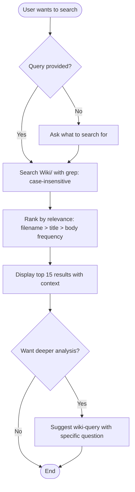

# Search the LLM Wiki

Lightweight, read-only search across all wiki pages. Returns ranked results with context snippets. No modifications to any files.

## Overview

This is the fastest way to find information in the wiki. It searches across all Wiki/ pages (filenames and contents), ranks results by relevance, and returns matching pages with brief context. Use this for quick lookups; use `wiki-query` when you need a synthesized answer.

## When to Use

- User says "search wiki", "find in wiki", "look up in my wiki", "wiki lookup"
- Quick lookup of a specific page or topic
- Finding pages that mention a keyword
- Browsing wiki content before a deeper query

## When NOT to Use

- User wants a synthesized answer with analysis → use `wiki-query`
- User wants to add content to the wiki → use `wiki-ingest`
- User wants to check wiki health → use `wiki-lint`
- No wiki initialized (no Wiki/index.md) → use `wiki-init`

## Workflow



## Implementation

### Step 1: Search All Wiki Pages

Use grep to search for the query terms across all files in `Wiki/` (excluding `log.md`):

- Search in filenames AND file contents.
- Use case-insensitive matching.
- Match any word in the query (OR logic) for broad results, or all words (AND logic) if the query is specific (3+ terms).

### Step 2: Rank Results

Sort by relevance:

1. **Filename match** (highest priority) — the query terms appear in the page filename.
2. **Title/frontmatter match** — the query terms appear in the page title.
3. **Body frequency** — number of occurrences of query terms in the page body.
4. **Query term coverage** — number of matching query terms hit.

### Step 3: Display Results

For each match, show:

```
[[page-name]] (type)
  > First relevant line or summary sentence from the page...
```

Limit to 15 results. If there are more, note the total count.

### Step 4: Offer Follow-up

If the user wants deeper analysis, suggest `wiki-query` with a specific question based on the search results.

## Parameter Reference

| Parameter | Type | Required | Description |
|-----------|------|----------|-------------|
| query | string | Yes | Search terms. Asked interactively if not provided. |

## Common Mistakes

| Mistake | Fix |
|---------|-----|
| Searching in `Sources/` or `Clippings/` instead of `Wiki/` | Only search within `Wiki/` — raw sources are not wiki pages |
| Creating or modifying files | This is a strictly read-only operation — never write anything |
| Doing deep analysis instead of quick results | Return results fast. If the user needs analysis, suggest `wiki-query` |
| Returning too many results | Limit to 15 results with context — more than that is overwhelming |
| Not excluding log.md from search | `Wiki/log.md` is not a content page — exclude it from search results |
