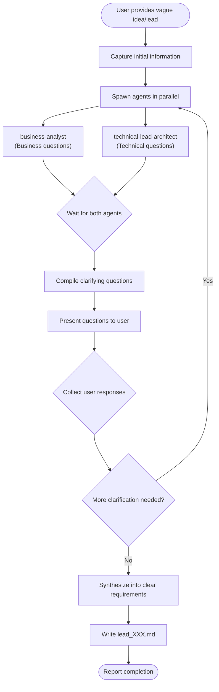

# CM Brainstorm

## Overview

Transforms vague ideas, rough concepts, and unstructured leads into clear, actionable requirements through collaborative analysis and targeted questioning. Spawns `business-analyst` and `technical-lead-architect` agents to examine the lead from multiple perspectives, identify gaps, and formulate clarifying questions that drive toward well-defined requirements.

**Core principle:** Great requirements emerge from asking the right questions, not making assumptions. Collaborative exploration uncovers hidden constraints and opportunities.

## When to Use

Use when:
- User has a vague idea or rough concept they want to explore
- User provides incomplete or ambiguous information about a feature
- User says things like "I'm thinking about..." or "We might need..."
- User wants to clarify assumptions before committing to a solution
- Starting the discovery phase for a new initiative

Do NOT use when:
- User asks simple questions (just answer directly)
- User provides well-defined requirements (use `analyze` skill instead)
- User requests code changes (this is discovery only)
- Requirements are already documented in a PRD

## Workflow



## Implementation

### Step 1: Capture Initial Information

Gather all the information the user has provided:

- What is the core idea or problem?
- Who are the stakeholders or users?
- What is the context or business domain?
- Any constraints, deadlines, or preferences mentioned?
- What is the desired outcome?

If the initial input is very sparse, ask the user for basic context before spawning agents.

### Step 2: Spawn Agents in Parallel

Use the Agent tool to spawn both agents simultaneously:

```
Agent (subagent_type: "business-analyst")
- prompt: You are analyzing a vague product idea/lead. Generate probing questions to clarify the BUSINESS aspects:

  1. Who are the target users and what are their goals?
  2. What business problem does this solve?
  3. What is the expected business value or ROI?
  4. Who are the stakeholders and what are their priorities?
  5. What are the success metrics?
  6. Are there any business constraints (budget, timeline, compliance)?
  7. What are the user workflows and pain points?
  8. Are there existing solutions or competitors to consider?

  Initial Lead:
  [User's vague idea or concept]

  Generate 5-10 specific, actionable questions that will help clarify the business requirements.
- description: "Generate business questions"
- run_in_background: true

Agent (subagent_type: "technical-lead-architect")
- prompt: You are analyzing a vague product idea/lead. Generate probing questions to clarify the TECHNICAL aspects:

  1. What systems or platforms are involved?
  2. Are there existing technical constraints or legacy systems?
  3. What are the integration requirements?
  4. What are the scalability and performance expectations?
  5. What are the security and compliance requirements?
  6. What is the expected user load and usage patterns?
  7. Are there technology preferences or restrictions?
  8. What are the data requirements (storage, processing, privacy)?

  Initial Lead:
  [User's vague idea or concept]

  Generate 5-10 specific, actionable questions that will help clarify the technical requirements.
- description: "Generate technical questions"
- run_in_background: true
```

### Step 3: Compile Clarifying Questions

Combine the questions from both agents into a structured format:

| Category | Questions |
|----------|-----------|
| Business | [From business-analyst] |
| Technical | [From technical-lead-architect] |

Remove duplicate or redundant questions. Prioritize questions that address the biggest areas of uncertainty.

### Step 4: Present Questions to User

Use the AskUserQuestion tool to present the most critical questions to the user:

```
AskUserQuestion
- questions:
  - question: "[Business question from BA]"
    header: "Business"
    options: [If applicable, provide common options]
    multiSelect: false/true
  - question: "[Technical question from TLA]"
    header: "Technical"
    options: [If applicable, provide common options]
    multiSelect: false/true
  ...
```

For open-ended questions where options don't apply, present them as text for the user to respond to directly.

### Step 5: Collect and Analyze Responses

Review the user's responses:

- Do they answer the questions adequately?
- Do they reveal new areas of uncertainty?
- Are there contradictions or ambiguities?

If responses are still vague or incomplete, iterate:
- Spawn agents again with the new context
- Generate follow-up questions
- Repeat until requirements are clear

### Step 6: Synthesize into Clear Requirements

Once you have sufficient information, synthesize the findings:

| Aspect | Clarified Requirement |
|--------|----------------------|
| Problem Statement | [What problem are we solving] |
| Target Users | [Who will use this] |
| Business Value | [Why this matters] |
| Success Metrics | [How we measure success] |
| Technical Context | [Systems, platforms, constraints] |
| Key Features | [What needs to be built] |
| Out of Scope | [What we're not doing] |
| Assumptions | [What we're assuming] |
| Open Questions | [Still unresolved items] |

### Step 7: Write Lead Document

Create the lead file at `docs/leads/lead_[YYMMDD]_[topic].md`:

```markdown
# Lead: [Feature/Initiative Name]

## Document Information
- **Lead ID:** L[YYMMDD]-[topic]
- **Created:** [Date]
- **Status:** Clarified / Needs Further Discussion
- **Next Step:** [analyze / design / More questions needed]

## Original Input
[The user's initial vague idea or concept]

---

## Clarified Requirements

### Problem Statement
[Clear description of the problem to solve]

### Target Users
- Primary: [Who are the main users]
- Secondary: [Other stakeholders]

### Business Context
- **Business Value:** [Why this matters to the business]
- **Success Metrics:** [How we measure success]
- **Constraints:** [Budget, timeline, compliance, etc.]

### Technical Context
- **Systems Involved:** [What platforms/systems]
- **Integrations:** [What needs to connect to what]
- **Technical Constraints:** [Legacy systems, tech restrictions]

### Key Features
1. [Feature 1]
2. [Feature 2]
3. [Feature 3]

### Out of Scope
- [What we're explicitly not doing]
- [Future considerations]

---

## Clarification Q&A

### Business Questions
| Question | Answer |
|----------|--------|
| [Question from BA] | [User's answer] |
| [Question from BA] | [User's answer] |

### Technical Questions
| Question | Answer |
|----------|--------|
| [Question from TLA] | [User's answer] |
| [Question from TLA] | [User's answer] |

---

## Assumptions
- [Assumption 1]
- [Assumption 2]
- [Assumption 3]

## Open Questions
- [ ] [Still unresolved question 1]
- [ ] [Still unresolved question 2]

## Risks Identified
| Risk | Impact | Mitigation |
|------|--------|------------|
| [Risk] | [H/M/L] | [How to address] |

---

## Next Steps
- [ ] [Recommended next action, e.g., "Run /analyze to create PRD"]
- [ ] [Any follow-up discussions needed]

## Appendix

### Discovery Session Log
- **Round 1:** [Summary of first round of questions]
- **Round 2:** [Summary of follow-up questions if any]
```

## Example

**User input:**
> "I want to add SSO to our app"

**Action:**
1. Capture initial info: SSO feature, but unclear about provider, users, use case
2. Spawn `business-analyst` → questions about user types, login flows, compliance needs
3. Spawn `technical-lead-architect` → questions about current auth system, provider preferences, integration complexity
4. Present questions to user:
   - "Which SSO provider(s) do you need? (Okta, Azure AD, Google, etc.)"
   - "Who are the users needing SSO? (employees, customers, partners)"
   - "Do you need just authentication or also authorization/permissions?"
5. Collect responses and iterate if needed
6. Synthesize into `docs/leads/lead_260401_sso-integration.md`

**Result:**
The user now has a clear document that captures:
- Exactly which SSO provider(s) to integrate
- Who the target users are
- What the authentication flow should look like
- Technical constraints and requirements
- What's in and out of scope
- What the next steps should be

## Common Mistakes

| Mistake | Fix |
|---------|-----|
| Making assumptions instead of asking | Always ask questions rather than guess |
| Asking too many questions at once | Prioritize and batch questions into rounds |
| Accepting vague answers | Follow up with "can you give me a specific example?" |
| Skipping the synthesis step | Must transform Q&A into structured requirements |
| Creating docs/leads if missing | Create the directory if it doesn't exist |
| Rushing to solution | Stay in discovery mode until requirements are clear |
| Not documenting assumptions | Always list what you're assuming explicitly |
| Forgetting open questions | Track unresolved items for future discussion |

## Important Rules

1. **NO CODE CHANGES** - This is a discovery and clarification process only
2. **Always ask questions** - Never assume you understand a vague requirement
3. **Iterate as needed** - Some leads require multiple rounds of clarification
4. **Document everything** - Capture the original input and all Q&A for traceability
5. **Stay neutral** - Don't push toward a particular solution during brainstorming
6. **Be patient** - Users may need time to think through questions

## File Output

- **Location:** `docs/leads/lead_[YYMMDD]_[topic].md`
- **Naming format:**
  - `[YYMMDD]` = Date in YYMMDD format (e.g., 260401 for April 1, 2026)
  - `[topic]` = Kebab-case topic name (e.g., `okta-integration`, `user-reporting`)
  - Example: `lead_260401_okta-integration.md`
- **Create directory:** If `docs/leads/` doesn't exist, create it
- **Status field:** Indicate if lead is "Clarified" or "Needs Further Discussion"
