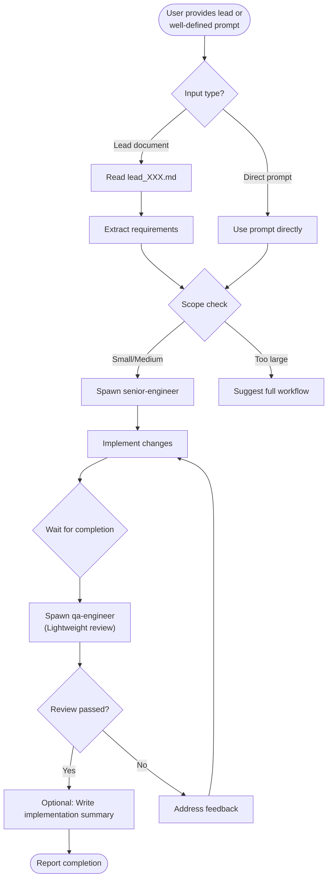

# CM Fast-Track

## Overview

Bypasses documentation workflow for well-defined, small-scope work. Spawns `senior-engineer` to implement directly from requirements, followed by lightweight `qa-engineer` review. No PRD, design, or plan documents created.

**Core principle:** Small, clear-scope changes don't need heavyweight documentation - implement, review lightly, ship.

## When to Use

Use when:
- User provides a lead document (lead_XXX.md) and wants to implement immediately
- User provides well-defined, clear requirements and wants to skip documentation
- User says "just implement this" or "skip the paperwork"
- Scope is small to medium (1-3 files, clear boundaries)

Do NOT use when:
- Requirements are vague or unclear (use `brainstorm` skill first)
- Scope is large or complex (use full workflow: analyze → design → plan → task)
- User asks simple questions (just answer directly)
- Multiple components/systems are involved

## Workflow



## Implementation

### Step 1: Parse Input

Determine the input type and extract requirements:

**If lead document path provided:**
1. Read the lead document using Read tool
2. Extract the "Clarified Requirements" section
3. Use extracted requirements as implementation input

**If direct prompt provided:**
1. Use the prompt as-is for implementation
2. No preprocessing needed

### Step 2: Scope Check

Assess if the work is appropriate for fast-track:

| Scope Indicator | Fast-Track OK | Full Workflow |
|-----------------|---------------|---------------|
| Files affected | 1-3 files | 4+ files |
| Components | Single component | Multiple components |
| Requirements clarity | Fully defined | Needs analysis |
| Risk level | Low | Medium/High |
| Dependencies | Minimal/None | Complex |

If scope is too large, inform the user:
```
This task appears to involve [X files / multiple components / complex dependencies].

Recommend using the full workflow for better results:
1. /analyze - Create PRD with business and technical analysis
2. /design - Create technical design document
3. /plan - Create implementation plan
4. /task - Execute with full review

Would you like to proceed with fast-track anyway, or switch to the full workflow?
```

### Step 3: Spawn Senior Engineer

Use the Agent tool to spawn the implementation agent:

```
Agent (subagent_type: "senior-engineer")
- prompt: Implement the following requirements directly:

  [Requirements from lead or prompt]

  Guidelines:
  - Make minimal, focused changes
  - Follow existing code patterns in the project
  - Write tests if applicable
  - Do NOT create documentation files (PRD, design, plan)
  - Do NOT create implementation summaries

- description: "Implement [feature name]"
```

### Step 4: Wait for Implementation

Use TaskOutput to wait for the senior-engineer to complete. Collect:
- Summary of changes made
- Files modified/created
- Tests written/run
- Any issues encountered

### Step 5: Lightweight QA Review

Spawn qa-engineer for a focused review:

```
Agent (subagent_type: "qa-engineer")
- prompt: Quick review of implementation changes:

  Files Changed: [list of files]

  Requirements: [brief summary of what was implemented]

  Perform a lightweight review:
  1. Code correctness - does it do what's intended?
  2. Basic error handling - are edge cases covered?
  3. No obvious bugs or issues
  4. Tests pass (if applicable)

  Focus on critical issues only. Skip comprehensive testing.
  Report: PASSED or FAILED with critical issues list.

- description: "Quick QA review"
```

### Step 6: Evaluate Review

| Review Outcome | Action |
|----------------|--------|
| PASSED | Proceed to completion |
| FAILED with critical issues | Spawn senior-engineer to fix, re-review |

### Step 7: Optional Implementation Summary

If the user wants documentation for reference, create a brief summary:

**Location:** `docs/implementation/impl_[XXX].md`

```markdown
# Implementation: [Feature Name]

- **Date:** [YYYY-MM-DD]
- **Source:** [Lead document path or "Direct prompt"]
- **Files Changed:** [List of files]

## Summary
[Brief description of changes made]

## Requirements Implemented
- [Requirement 1]
- [Requirement 2]

## Notes
[Any relevant notes or decisions made during implementation]
```

Only create this if user requests it or if the implementation is complex enough to warrant a record.

### Step 8: Report Completion

Provide a concise summary to the user:

```
Fast-Track Complete

Changes Made:
- [Brief description of implementation]

Files Modified:
- path/to/file1
- path/to/file2

QA Review: PASSED

[Optional] Implementation summary saved to: docs/implementation/impl_XXX.md
```

## Comparison with Full Workflow

| Aspect | fast-track | Full Workflow |
|--------|------------|---------------|
| Documentation | Optional summary | PRD, design, plan |
| Review | QA only | BA, TLA, QA |
| Best for | Small, clear scope | Large, complex scope |
| Speed | Fast | Thorough |
| Risk | Higher (less review) | Lower (multi-perspective) |
| Agent spawns | 2 (engineer + QA) | 5+ (BA, TLA x2, engineers, QA) |

## Example

**User input:**
> "/fast-track Add a rate limiter to the API endpoints, max 100 requests per minute per IP"

**Action:**
1. Parse input: Direct prompt, clear requirements
2. Scope check: Single feature, likely 1-2 files (middleware + config)
3. Spawn senior-engineer → implements rate limiting middleware
4. Wait for completion → middleware added, tests written
5. Spawn qa-engineer → reviews implementation
6. QA review: PASSED
7. Report completion with files changed

**Output:**
```
Fast-Track Complete

Changes Made:
- Added rate limiting middleware using express-rate-limit
- Configured 100 req/min per IP limit
- Applied to all /api/* endpoints
- Added unit tests for rate limit logic

Files Modified:
- src/middleware/rateLimiter.ts (new)
- src/app.ts (added middleware)
- tests/rateLimiter.test.ts (new)

QA Review: PASSED
```

## Common Mistakes

| Mistake | Fix |
|---------|-----|
| Using fast-track for vague requirements | Use `brainstorm` skill first to clarify |
| Skipping scope check | Always assess scope before proceeding |
| Creating documentation files | fast-track explicitly skips docs unless user requests summary |
| Ignoring "too large" warning | Trust the scope check, suggest full workflow |
| Single review failure loop | After 2 failed reviews, escalate to user |

## Decision Flow

```
User request
    │
    ▼
Requirements clear? ─── No ──→ /brainstorm
    │
   Yes
    │
    ▼
Scope small/medium? ─── No ──→ /analyze (full workflow)
    │
   Yes
    │
    ▼
/fast-track
```
