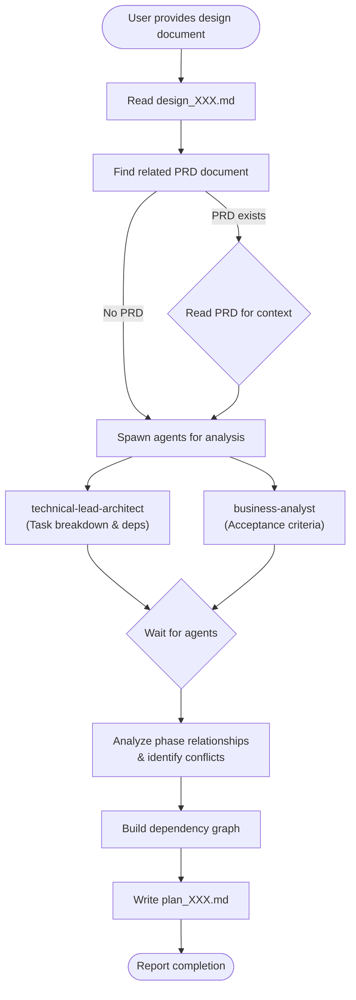

# CM Plan

## Overview

Transforms System Design documents into detailed implementation plans with actionable tasks. Analyzes design phases, creates task breakdowns, identifies dependencies between phases, and surfaces potential conflicts before implementation begins.

**Core principle:** A well-structured implementation plan prevents wasted effort by identifying dependencies and conflicts upfront, enabling parallel work where possible and ensuring sequential work is properly ordered.

## When to Use

Use when:
- User provides a design document and requests implementation planning
- User asks to "plan the implementation" or "break down tasks"
- Moving from design to implementation phase
- Need to identify task dependencies and potential conflicts

Do NOT use when:
- User asks simple questions (just answer directly)
- User requests code changes without planning documentation
- No design document exists yet (use `design` skill first)

## Workflow



## Implementation

### Step 1: Read the Design Document

Use the Read tool to load the design document from the path provided by the user.

### Step 2: Find and Read Related PRD

Extract the related PRD reference from the design document header, then read it for business context:

```
Design document header example:
- **Related PRD:** docs/requirements/prd_001.md
```

### Step 3: Spawn Agents for Analysis

Spawn agents in parallel to analyze different aspects:

```
Agent (subagent_type: "technical-lead-architect")
- prompt: Analyze this system design and create a detailed task breakdown:

  1. Break down each phase into granular, checkable tasks (2-4 hour chunks)
  2. Identify dependencies between tasks (what must complete before another can start)
  3. Identify tasks that can run in parallel
  4. Flag potential conflicts between phases
  5. Identify shared resources/components that could cause merge conflicts
  6. Suggest optimal task ordering for minimal blocking

  Design Document Content:
  [Design content here]

  Related PRD (for context):
  [PRD content here if available]
- description: "Break down design into tasks"
- run_in_background: true

Agent (subagent_type: "business-analyst")
- prompt: Review this system design and PRD to:

  1. Map tasks to acceptance criteria from the PRD
  2. Identify missing acceptance criteria for tasks
  3. Flag any gaps between design and requirements
  4. Suggest test scenarios for each task
  5. Prioritize tasks based on business value

  Design Document Content:
  [Design content here]

  Related PRD (for context):
  [PRD content here if available]
- description: "Map tasks to acceptance criteria"
- run_in_background: true
```

### Step 4: Analyze Phase Relationships

Build a comprehensive understanding of how phases relate:

| Relationship Type | Description | Example |
|-------------------|-------------|---------|
| **Sequential** | Phase B cannot start until Phase A completes | Database migration must complete before model updates |
| **Parallel** | Phases can run simultaneously | Frontend and backend work on separate components |
| **Overlapping** | Phases share work but have independent parts | Two phases both modify User model |
| **Blocking** | One phase blocks another's progress | API design blocks frontend integration |

### Step 5: Identify Conflicts

Surface potential conflicts before implementation:

| Conflict Type | Detection | Mitigation |
|---------------|-----------|------------|
| **File conflicts** | Multiple phases modifying same files | Sequential ordering or worktree isolation |
| **Database conflicts** | Concurrent schema changes | Combine migrations or sequence carefully |
| **Interface conflicts** | Changing shared interfaces | Define contracts first, implement later |
| **Resource conflicts** | Shared services/dependencies | Coordinate timing or abstract interfaces |

### Step 6: Build Dependency Graph

Create a visual and textual representation of task dependencies:

```
Phase 1: Foundation
├── [T1.1] Install dependencies ─────────────────┐
├── [T1.2] Configure environment ────────────────┤
└── [T1.3] Create database migrations ───────────┤
                                                 │ (blocks all Phase 2)
Phase 2: Core Implementation                     │
├── [T2.1] Create models ◄───────────────────────┘
├── [T2.2] Create services ◄─── (needs T2.1)
└── [T2.3] Create controllers ◄─ (needs T2.1, T2.2)

Phase 3: Integration (parallel with Phase 4)
├── [T3.1] Frontend components
└── [T3.2] API integration ◄───── (needs T2.3)

Phase 4: Testing
└── [T4.1] Write tests ◄───────── (needs T3.2)
```

### Step 7: Write Implementation Plan

Create the plan file at `docs/plans/plan_[XXX].md`:

```markdown
# Implementation Plan: [Feature Name]

## Document Information
- **Plan ID:** P[XXX]
- **Created:** [Date]
- **Status:** Draft
- **Related Design:** [Link to design document]
- **Related PRD:** [Link to PRD document]

## Executive Summary
[Brief overview of the implementation approach, key phases, and timeline estimate]

## Phase Overview

| Phase | Name | Tasks | Dependencies | Can Parallel With |
|-------|------|-------|--------------|-------------------|
| 1 | Foundation | 5 | None | - |
| 2 | Core | 8 | Phase 1 | - |
| 3 | Integration | 6 | Phase 2 | Phase 4 |
| 4 | Testing | 4 | Phase 3 | - |

## Dependency Graph

    ```
    [ASCII dependency graph showing task relationships]
    ```

---

## Phase 1: [Name]

**Goal:** [Phase objective]
**Duration Estimate:** [X days]
**Dependencies:** None / [List dependencies]
**Parallel With:** [Other phases or "None"]

### Tasks

#### [T1.1] Task Name
- **Description:** [What needs to be done]
- **Acceptance Criteria:**
  - [ ] [Criterion 1]
  - [ ] [Criterion 2]
- **Files Affected:**
  - `path/to/file1`
  - `path/to/file2`
- **Dependencies:** None
- **Blocks:** [T1.2], [T2.1]
- **Test Scenarios:**
  - [Scenario 1]
  - [Scenario 2]

#### [T1.2] Task Name
- **Description:** [What needs to be done]
- **Acceptance Criteria:**
  - [ ] [Criterion 1]
- **Files Affected:**
  - `path/to/file`
- **Dependencies:** [T1.1]
- **Blocks:** [T2.1]

---

## Phase 2: [Name]

**Goal:** [Phase objective]
**Duration Estimate:** [X days]
**Dependencies:** Phase 1 complete
**Parallel With:** None

### Tasks

[Same structure as Phase 1]

---

## Conflict Analysis

### Identified Conflicts

| Conflict ID | Type | Description | Affected Phases | Resolution |
|-------------|------|-------------|-----------------|------------|
| C1 | File | Both Phase 2 and 3 modify User model | 2, 3 | Sequence: P2 before P3 |
| C2 | Database | Concurrent migrations on users table | 1, 2 | Combine into single migration |

### Conflict Resolution Strategy

1. **File Conflicts:** [Strategy for handling]
2. **Database Conflicts:** [Strategy for handling]
3. **Interface Conflicts:** [Strategy for handling]

---

## Parallelization Opportunities

### Can Run Simultaneously

| Group | Phases/Tasks | Condition |
|-------|--------------|-----------|
| A | Phase 3 Frontend + Phase 4 Tests | After Phase 2 complete |
| B | [T2.2] + [T2.3] | After [T2.1] complete |

### Must Be Sequential

1. Phase 1 → Phase 2 (foundation required)
2. [T2.1] → [T2.2] (models needed for services)

---

## Risk Register

| Risk ID | Description | Likelihood | Impact | Mitigation |
|---------|-------------|------------|--------|------------|
| R1 | [Risk description] | H/M/L | H/M/L | [How to mitigate] |

---

## Testing Strategy

### Unit Tests
- [Test category 1]
- [Test category 2]

### Feature Tests
- [Test scenario 1]
- [Test scenario 2]

### Integration Tests
- [Test scenario 1]

---

## Rollback Strategy

### Per-Phase Rollback

| Phase | Rollback Steps |
|-------|----------------|
| 1 | [Steps to revert Phase 1] |
| 2 | [Steps to revert Phase 2] |

---

## Checklist

### Before Starting Implementation
- [ ] All design questions resolved
- [ ] Environment variables configured
- [ ] Dependencies installed
- [ ] Branch strategy agreed

### Phase Completion Checklist
- [ ] All tasks in phase complete
- [ ] All tests passing
- [ ] Code review complete
- [ ] Documentation updated

---

## Appendix

### A. File Impact Summary

| File | Phases Modifying | Type of Change |
|------|------------------|----------------|
| `src/models/User` | 1, 2 | Add fields, add methods |
| `src/routes` | 2, 3 | Add routes |

### B. Task Quick Reference

| Task ID | Name | Phase | Dependencies | Est. Hours |
|---------|------|-------|--------------|------------|
| T1.1 | [Name] | 1 | None | 2 |
| T1.2 | [Name] | 1 | T1.1 | 4 |
```

## Example

**User input:**
> "Create an implementation plan from docs/designs/design_001.md"

**Action:**
1. Read `docs/designs/design_001.md`
2. Extract related PRD: `docs/requirements/prd_001.md`
3. Read the PRD for business context
4. Spawn `technical-lead-architect` → task breakdown, dependencies, conflicts
5. Spawn `business-analyst` → acceptance criteria mapping, test scenarios
6. Analyze phase relationships
7. Build dependency graph
8. Create `docs/plans/plan_001.md` with comprehensive implementation plan

## Common Mistakes

| Mistake | Fix |
|---------|-----|
| Not reading related PRD | Always read the PRD for business context and acceptance criteria |
| Tasks too large | Break tasks into 2-4 hour chunks with clear deliverables |
| Missing dependencies | Trace every task's inputs and outputs to find hidden dependencies |
| Ignoring conflicts | Surface all potential file/resource conflicts upfront |
| Vague acceptance criteria | Each task must have testable acceptance criteria |
| Skipping dependency graph | Visual graph helps identify parallelization opportunities |
| Creating docs/plans if missing | Create the directory if it doesn't exist |

## File Output

- **Location:** `docs/plans/plan_[XXX].md`
- **Naming:** Match the design document number (e.g., `design_001.md` → `plan_001.md`)
- **Create directory:** If `docs/plans/` doesn't exist, create it
- **Reference documents:** Always include links to source design and PRD in document header
