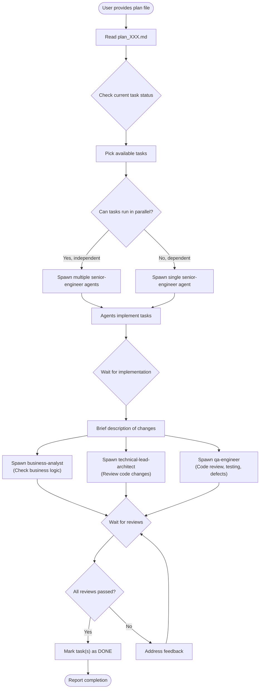

# CM Task

## Overview

Executes implementation plans by spawning `senior-engineer` agents to handle tasks from plan documents. Supports parallel task execution for independent tasks, followed by triple review validation (business-analyst, technical-lead-architect, and qa-engineer) before marking tasks as complete.

**Core principle:** Implementation efficiency comes from parallel execution of independent tasks, with quality ensured through multi-perspective review (business logic, technical architecture, and QA) before completion.

## When to Use

Use when:
- User provides a plan file (e.g., `plan_001.md`, `plan_010.md`) and wants to execute tasks
- User asks to "work on the plan" or "execute tasks from plan"
- User wants to check progress on an existing plan
- Moving from planning phase to implementation phase

Do NOT use when:
- User asks simple questions (just answer directly)
- No plan document exists yet (use `plan` skill first)
- User requests code changes unrelated to an existing plan

## Workflow



## Implementation

### Step 1: Read the Plan File

Use the Read tool to load the plan document from the path provided by the user.

```
Plan file location: docs/plans/plan_[XXX].md
```

### Step 2: Check Current Task Status

Analyze the plan to identify:
- Tasks already marked as DONE
- Tasks currently IN PROGRESS
- Tasks that are PENDING (not started)
- Tasks blocked by dependencies

### Step 3: Identify Available Tasks

Select tasks that:
- Have status `PENDING` (unchecked in the plan)
- Have all dependencies completed (check `Dependencies:` field)
- Can be worked on now

### Step 4: Determine Parallelization

Analyze if multiple tasks can run in parallel:

| Condition | Action |
|-----------|--------|
| Tasks are independent (no shared files, no dependencies) | Spawn multiple agents in parallel |
| Tasks share files or have dependencies | Spawn single agent, work sequentially |
| Mix of independent and dependent tasks | Group independent tasks, spawn multiple agents for each group |

### Step 5: Spawn Senior Engineer Agent(s)

Use the Agent tool to spawn `senior-engineer` agents:

**For single task:**
```
Agent (subagent_type: "senior-engineer")
- prompt: Implement the following task from the implementation plan:

  Task ID: [T1.1]
  Task Name: [Task Name]
  Description: [What needs to be done]

  Acceptance Criteria:
  - [ ] [Criterion 1]
  - [ ] [Criterion 2]

  Files Affected:
  - path/to/file1
  - path/to/file2

  Related Design: docs/designs/design_XXX.md
  Related PRD: docs/requirements/prd_XXX.md

  Please implement this task following the acceptance criteria.
  Ensure all tests pass before completing.

- description: "Implement [task name]"
```

**For multiple parallel tasks:**
```
Agent (subagent_type: "senior-engineer")
- prompt: [Task 1 details]
- description: "Implement [task 1 name]"
- run_in_background: true

Agent (subagent_type: "senior-engineer")
- prompt: [Task 2 details]
- description: "Implement [task 2 name]"
- run_in_background: true

Agent (subagent_type: "senior-engineer")
- prompt: [Task 3 details]
- description: "Implement [task 3 name]"
- run_in_background: true
```

### Step 6: Wait for Implementation

Use TaskOutput to collect results from all spawned agents. Each agent returns:
- Summary of changes made
- Files modified/created
- Tests written/run
- Any issues encountered

### Step 7: Brief Summary of Changes

After all agents complete, provide a concise summary of what was implemented:

```
Changes Summary:
- [Task 1]: Brief description of implementation
- [Task 2]: Brief description of implementation
- [Task 3]: Brief description of implementation

Files Modified:
- path/to/file1
- path/to/file2
```

### Step 8: Spawn Review Agents in Parallel

Spawn all three review agents simultaneously:

```
Agent (subagent_type: "business-analyst")
- prompt: Review the following implementation changes for business logic correctness:

  Plan: docs/plans/plan_XXX.md
  Related PRD: docs/requirements/prd_XXX.md

  Tasks Implemented:
  - [T1.1]: [Description]
  - [T1.2]: [Description]

  Changes Made:
  [Summary of changes from Step 7]

  Please verify:
  1. All acceptance criteria are met
  2. Business rules are correctly implemented
  3. No business logic gaps or errors
  4. User stories are satisfied

- description: "Review business logic"
- run_in_background: true

Agent (subagent_type: "technical-lead-architect")
- prompt: Review the following implementation changes for technical quality:

  Plan: docs/plans/plan_XXX.md
  Related Design: docs/designs/design_XXX.md

  Tasks Implemented:
  - [T1.1]: [Description]
  - [T1.2]: [Description]

  Files Changed:
  [List of files]

  Please review:
  1. Code quality and best practices
  2. Architectural alignment with design
  3. Security considerations
  4. Performance implications
  5. Test coverage adequacy

- description: "Review technical changes"
- run_in_background: true

Agent (subagent_type: "qa-engineer")
- prompt: Review the following implementation changes for code quality, defects, and test coverage:

  Plan: docs/plans/plan_XXX.md
  Related PRD: docs/requirements/prd_XXX.md
  Related Design: docs/designs/design_XXX.md

  Tasks Implemented:
  - [T1.1]: [Description]
  - [T1.2]: [Description]

  Files Changed:
  [List of files]

  Changes Made:
  [Summary of changes from Step 7]

  Please perform:
  1. Line-by-line code review for correctness, edge cases, and error handling
  2. Security vulnerability assessment
  3. Verify test coverage — identify missing tests for critical paths
  4. Validate acceptance criteria are testable and tested
  5. Check for code smells, anti-patterns, and maintainability issues
  6. Run existing tests and report results
  7. Deliver findings in QA Report format (Critical / Major / Minor / Observations)

- description: "QA review and testing"
- run_in_background: true
```

### Step 9: Collect Review Results

Use TaskOutput to wait for all three review agents to complete.

### Step 10: Evaluate Reviews

| Review Outcome | Action |
|----------------|--------|
| All three pass | Proceed to mark tasks DONE |
| Business-analyst fails | Address business logic issues, re-review |
| Technical-lead-architect fails | Address technical issues, re-review |
| QA-engineer fails | Address code quality / test issues, re-review |
| Multiple reviewers fail | Address all issues, spawn failed reviewers again |

### Step 11: Mark Tasks as DONE

Update the plan document to mark completed tasks:

**Before:**
```markdown
#### [T1.1] Task Name
- **Description:** [What needs to be done]
- **Acceptance Criteria:**
  - [ ] [Criterion 1]
  - [ ] [Criterion 2]
```

**After:**
```markdown
#### [T1.1] Task Name ✅ DONE
- **Description:** [What needs to be done]
- **Acceptance Criteria:**
  - [x] [Criterion 1]
  - [x] [Criterion 2]
- **Completed:** [Date]
```

### Step 12: Report Completion

Provide a final summary to the user:

```
Task Execution Complete

Tasks Completed:
- [T1.1]: Task Name ✅
- [T1.2]: Task Name ✅

Review Results:
- Business Logic Review: PASSED
- Technical Review: PASSED
- QA Review: PASSED

Next Steps:
- [ ] Remaining tasks in Phase 1
- [ ] Ready to proceed to Phase 2
```

## Checking Progress

When user asks to check progress:

1. Read the plan file
2. Count tasks by status (DONE, IN PROGRESS, PENDING)
3. Identify current phase and blockers
4. Report summary:

```
Plan Progress: docs/plans/plan_001.md

Phase 1: Foundation
- [T1.1] Install dependencies ✅ DONE
- [T1.2] Configure environment ✅ DONE
- [T1.3] Create database migrations ⏳ PENDING (blocked by T1.2)

Phase 2: Core Implementation
- [T2.1] Create models ⏳ PENDING (blocked by Phase 1)

Summary:
- Completed: 2/8 tasks (25%)
- In Progress: 0 tasks
- Pending: 6 tasks
- Blocked: 4 tasks

Ready to work on:
- [T1.3] Create database migrations (T1.2 now complete)
```

## Example

**User input:**
> "Execute tasks from docs/plans/plan_001.md"

**Action:**
1. Read `docs/plans/plan_001.md`
2. Identify available tasks: T2.1 (Create models), T2.2 (Create services) - both independent
3. Spawn 2 `senior-engineer` agents in parallel
4. Wait for both to complete
5. Summarize changes made
6. Spawn `business-analyst`, `technical-lead-architect`, and `qa-engineer` in parallel
7. Collect review results - all three pass
8. Update plan: mark T2.1 and T2.2 as DONE
9. Report completion

## Common Mistakes

| Mistake | Fix |
|---------|-----|
| Running dependent tasks in parallel | Always check dependencies before parallelizing |
| Skipping review step | All three reviews (BA, TLA, QA) must pass before marking DONE |
| Not reading related PRD/design | Provide context from related documents to agents |
| Marking DONE without tests | Verify tests pass before review |
| Ignoring blocked tasks | Report blocked tasks clearly to user |
| Single agent for all tasks | Parallelize independent tasks for efficiency |
| Forgetting to update plan | Always update the plan file after completion |

## File Operations

### Reading
- **Plan file:** `docs/plans/plan_[XXX].md`
- **Related PRD:** Check plan header for link
- **Related Design:** Check plan header for link

### Updating
- Mark tasks as DONE with `✅ DONE` suffix
- Check all acceptance criteria `[x]`
- Add completion date

## Task Status Indicators

| Indicator | Meaning |
|-----------|---------|
| (none) | PENDING - Not started |
| ⏳ | IN PROGRESS - Currently being worked on |
| ✅ DONE | Completed and reviewed |
| 🚫 | BLOCKED - Cannot proceed due to dependency |
