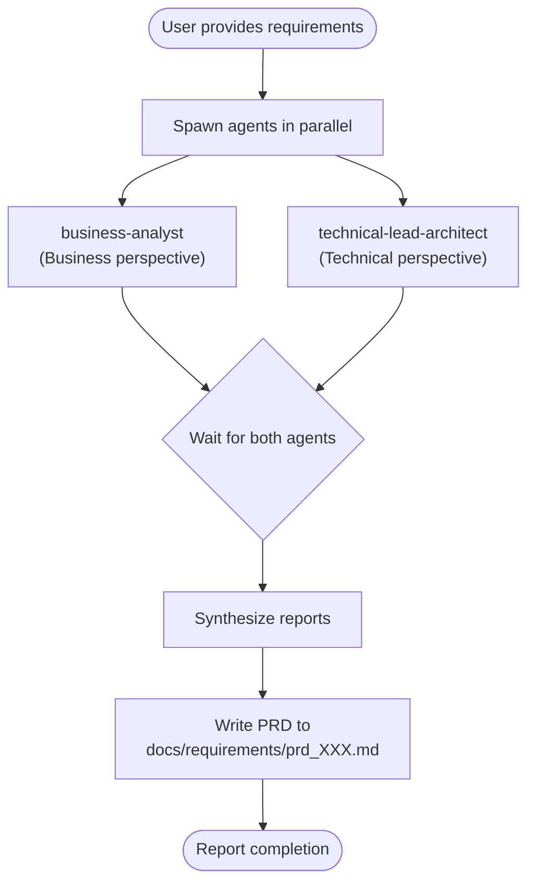

# CM Analyze

## Overview

Orchestrates parallel agent analysis to produce comprehensive Product Requirement Documents. Spawns `business-analyst` and `technical-lead-architect` agents simultaneously, then synthesizes their outputs into a unified PRD.

**Core principle:** Requirements analysis benefits from multiple expert perspectives working in parallel, then unified into a single coherent document.

## When to Use

Use when:
- User describes a new feature or business requirement
- User asks to "analyze requirements" or "create a PRD"
- User provides vague or multi-stakeholder requirements
- Starting a new feature that needs structured documentation

Do NOT use when:
- User asks simple questions (just answer directly)
- User requests code changes without documentation needs
- Requirements are already well-defined in a PRD

## Workflow



## Implementation

### Step 1: Spawn Agents in Parallel

Use the Agent tool to spawn both agents simultaneously:

```
Agent (subagent_type: "business-analyst")
- prompt: Analyze the following requirements from a business perspective: [user's requirements]
- description: "Analyze business requirements"

Agent (subagent_type: "technical-lead-architect")
- prompt: Analyze the following requirements from a technical/architectural perspective: [user's requirements]
- description: "Analyze technical requirements"
```

### Step 2: Synthesize Reports

Once both agents complete, combine their outputs:

| Business Analyst Focus | Technical Lead Focus |
|------------------------|----------------------|
| Stakeholder needs | System design |
| User stories | Technical constraints |
| Success metrics | Architecture decisions |
| Business rules | Implementation risks |
| Acceptance criteria | Technology choices |

### Step 3: Write PRD

Create a structured PRD at `docs/requirements/prd_[XXX].md` with:

```markdown
# [Feature Name] - Product Requirements Document

## Overview
[Synthesized summary]

## Business Requirements
[From business-analyst]

## Technical Requirements
[From technical-lead-architect]

## User Stories
[Combined and prioritized]

## Acceptance Criteria
[Measurable success criteria]

## Technical Architecture
[Recommended approach]

## Risks and Mitigations
[Identified risks with solutions]

## Out of Scope
[Explicitly excluded items]
```

## Example

**User input:**
> "I need a subscription billing system for my SaaS app"

**Action:**
1. Spawn `business-analyst` → analyzes subscription models, pricing tiers, payment flows, user needs
2. Spawn `technical-lead-architect` → analyzes payment gateway options, database schema, security, scalability
3. Synthesize into `docs/requirements/prd_[XXX].md` (e.g., `prd_001.md`, `prd_002.md`)

## Common Mistakes

| Mistake | Fix |
|---------|-----|
| Spawning agents sequentially | Always spawn in parallel for efficiency |
| Skipping synthesis step | Must combine perspectives, not just concatenate |
| Vague PRD file naming | Use descriptive kebab-case: `prd_user-authentication.md` |
| Creating docs/requirements if missing | Create the directory if it doesn't exist |

## File Output

- **Location:** `docs/requirements/prd_[XXX].md`
- **Naming:** Three-digit zero-padded incremental number (e.g., `prd_001.md`, `prd_002.md`)
- **Create directory:** If `docs/requirements/` doesn't exist, create it
