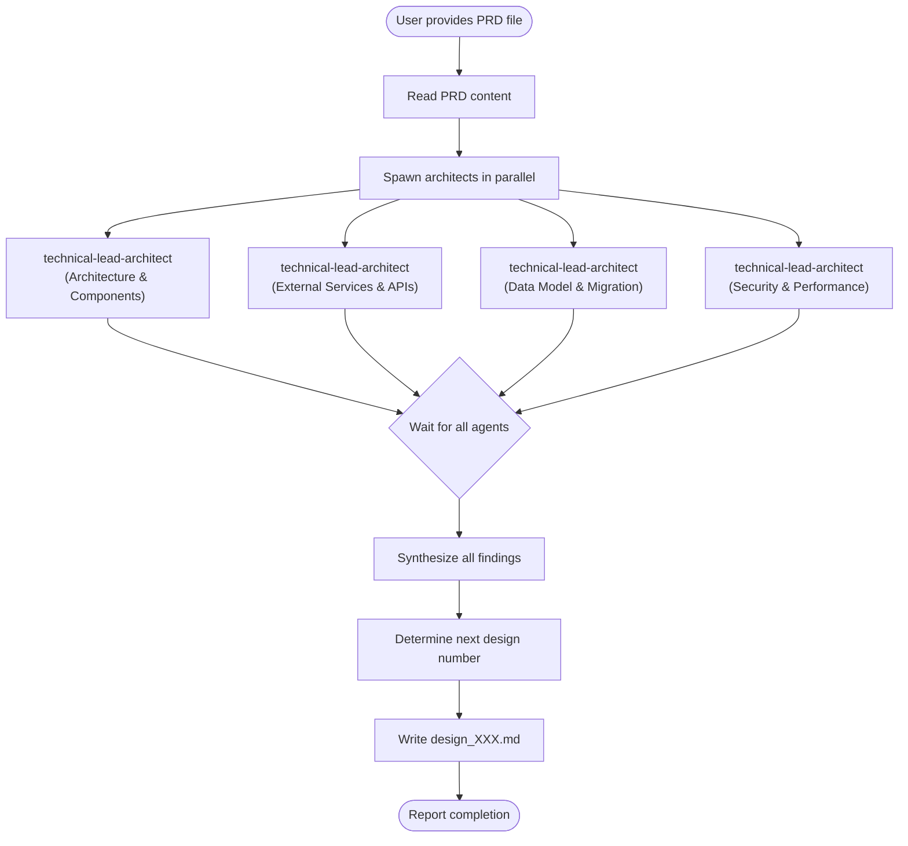

# CM Design

## Overview

Transforms Product Requirement Documents into comprehensive System Design documents. Spawns multiple `technical-lead-architect` agents simultaneously to research different aspects of the system, then synthesizes all findings into a unified design document.

**Core principle:** System design benefits from parallel expert analysis of different architectural concerns, unified into a coherent technical specification.

## When to Use

Use when:
- User provides a PRD file and requests system design
- User asks to "design the system" or "create technical design"
- Moving from requirements gathering to implementation planning
- Need architectural decisions documented before coding

Do NOT use when:
- User asks simple questions (just answer directly)
- User requests code changes without design documentation
- No PRD exists yet (use `analyze` skill first)

## Workflow



## Implementation

### Step 1: Read the PRD File

Use the Read tool to load the PRD content from the path provided by the user.

### Step 2: Spawn Multiple Architect Agents in Parallel

Use the Agent tool to spawn multiple `technical-lead-architect` agents simultaneously, each focusing on a specific domain:

```
Agent (subagent_type: "technical-lead-architect")
- prompt: Analyze this PRD focusing on ARCHITECTURE & COMPONENTS:
  1. High-level system architecture with diagrams
  2. Component breakdown and responsibilities
  3. Component interactions and communication patterns
  4. Technology stack decisions
  5. Design patterns to apply

  PRD Content:
  [PRD content here]
- description: "Research architecture & components"
- run_in_background: true

Agent (subagent_type: "technical-lead-architect")
- prompt: Analyze this PRD focusing on EXTERNAL SERVICES & APIS:
  1. Third-party integrations required
  2. API design (new endpoints, request/response formats)
  3. External dependencies and service contracts
  4. Integration patterns and error handling
  5. Rate limiting and retry strategies

  PRD Content:
  [PRD content here]
- description: "Research external services & APIs"
- run_in_background: true

Agent (subagent_type: "technical-lead-architect")
- prompt: Analyze this PRD focusing on DATA MODEL & MIGRATION:
  1. Database schema changes (new tables, columns, indexes)
  2. Entity relationships and data flow
  3. Migration strategy from current to target state
  4. Data integrity and consistency requirements
  5. Rollback plan

  PRD Content:
  [PRD content here]
- description: "Research data model & migration"
- run_in_background: true

Agent (subagent_type: "technical-lead-architect")
- prompt: Analyze this PRD focusing on SECURITY & PERFORMANCE:
  1. Authentication and authorization approach
  2. Data protection and encryption needs
  3. Security vulnerabilities and mitigations
  4. Scalability considerations
  5. Caching strategy and optimizations

  PRD Content:
  [PRD content here]
- description: "Research security & performance"
- run_in_background: true
```

### Step 3: Wait and Collect Results

Use TaskOutput to collect results from all background agents. Each agent returns detailed analysis for its domain.

### Step 4: Synthesize Findings

Combine all agent outputs into a coherent system design:

| Agent Focus | Contributions |
|-------------|---------------|
| Architecture & Components | System structure, components, tech stack |
| External Services & APIs | Integrations, endpoints, contracts |
| Data Model & Migration | Schema, relationships, migration plan |
| Security & Performance | Auth, protection, scalability |

### Step 5: Determine Design File Number

Check `docs/designs/` directory to find the next incremental number:

```bash
ls docs/designs/design_*.md 2>/dev/null | sort -V | tail -1
```

If no files exist, start with `001`. Otherwise, increment the highest number.

### Step 6: Write Design Document

Create the design file at `docs/designs/design_[XXX].md` with this structure:

```markdown
# System Design: [Feature Name]

## Document Information
- **Design ID:** D[XXX]
- **Created:** [Date]
- **Status:** Draft
- **Related PRD:** [Link to PRD file]

## 1. Architecture Overview

### 1.1 High-Level Architecture
[ASCII diagram or Mermaid diagram of system architecture]

### 1.2 Design Principles
[Key architectural decisions and rationale]

### 1.3 Technology Stack
| Layer | Technology | Justification |
|-------|------------|---------------|
| [Layer] | [Tech] | [Why] |

## 2. Components

### 2.1 Component Diagram
[Visual representation of components and interactions]

### 2.2 Component Details
| Component | Responsibility | Dependencies | Technology |
|-----------|---------------|--------------|------------|
| [Name] | [Description] | [Deps] | [Tech] |

### 2.3 Communication Patterns
[How components interact: sync/async, protocols]

## 3. External Services

### 3.1 Third-Party Integrations
| Service | Purpose | API Type | Authentication | Rate Limits |
|---------|---------|----------|----------------|-------------|
| [Name] | [Use] | [REST/GraphQL] | [Method] | [Limits] |

### 3.2 API Design
| Method | Endpoint | Description | Auth | Request | Response |
|--------|----------|-------------|------|---------|----------|
| [VERB] | [/path] | [Purpose] | [Required] | [Schema] | [Schema] |

### 3.3 Error Handling & Resilience
[Retry strategies, circuit breakers, fallbacks]

## 4. Data Model

### 4.1 Database Schema Changes
[New tables, columns, indexes with SQL or schema definitions]

### 4.2 Entity Relationships
[ERD diagram or relationship descriptions]

### 4.3 Data Integrity
[Constraints, validations, consistency requirements]

## 5. Migration Strategy

### 5.1 Current State
[Description of existing system]

### 5.2 Target State
[Description of end state after migration]

### 5.3 Migration Steps
| Step | Action | Risk | Rollback |
|------|--------|------|----------|
| 1 | [Action] | [Risk] | [How to revert] |

### 5.4 Rollback Plan
[Detailed rollback procedure]

## 6. Security

### 6.1 Authentication & Authorization
[How users/systems are authenticated and authorized]

### 6.2 Data Protection
[Encryption at rest/transit, PII handling, compliance]

### 6.3 Security Risks & Mitigations
| Risk | Impact | Mitigation |
|------|--------|------------|
| [Risk] | [High/Med/Low] | [Plan] |

## 7. Performance

### 7.1 Scalability
[Horizontal/vertical scaling approach, bottlenecks]

### 7.2 Caching Strategy
| What | Where | TTL | Invalidation |
|------|-------|-----|--------------|
| [Data] | [Layer] | [Time] | [Strategy] |

### 7.3 Optimization Opportunities
[Performance improvements and trade-offs]

## 8. Risks and Mitigations

| Risk | Impact | Likelihood | Mitigation | Owner |
|------|--------|------------|------------|-------|
| [Description] | [H/M/L] | [H/M/L] | [Plan] | [Team] |

## 9. Implementation Phases

### Phase 1: [Name] - [Duration]
**Goal:** [Phase objective]
- [ ] [Task 1]
- [ ] [Task 2]
**Dependencies:** [What must be done first]
**Deliverable:** [What this phase produces]

### Phase 2: [Name] - [Duration]
**Goal:** [Phase objective]
- [ ] [Task 1]
- [ ] [Task 2]

## Appendix

### A. Glossary
[Technical terms and definitions]

### B. References
[Links to documentation, RFCs, external resources]

### C. Decision Log
[Key decisions made during design and rationale]
```

## Example

**User input:**
> "Create a system design from docs/requirements/prd_subscription-billing.md"

**Action:**
1. Read `docs/requirements/prd_subscription-billing.md`
2. Spawn 4 `technical-lead-architect` agents in parallel:
   - Architecture & Components research
   - External Services & APIs research
   - Data Model & Migration research
   - Security & Performance research
3. Collect all agent outputs
4. Synthesize findings into unified design
5. Check `docs/designs/` - finds no existing files, use `001`
6. Create `docs/designs/design_001.md` with comprehensive system design

## Common Mistakes

| Mistake | Fix |
|---------|-----|
| Spawning agents sequentially | Always spawn all agents in parallel for efficiency |
| Not reading the PRD first | Always read the PRD file before spawning agents |
| Skipping synthesis step | Must combine perspectives coherently, not concatenate |
| Skipping number check | Always check existing design files for proper numbering |
| Overwriting existing designs | Use incremental numbering, never reuse numbers |
| Creating docs/designs if missing | Create the directory if it doesn't exist |
| Vague migration strategy | Provide concrete, actionable migration steps with rollback |
| Missing rollback plan | Every migration must have a clear rollback procedure |

## File Output

- **Location:** `docs/designs/design_[XXX].md`
- **Naming:** Three-digit zero-padded incremental number (e.g., `design_001.md`, `design_002.md`)
- **Create directory:** If `docs/designs/` doesn't exist, create it
- **Reference PRD:** Always include link to source PRD in document header
